# EduAssist-AI - Visual Architecture Diagrams

## 🏗️ System Architecture

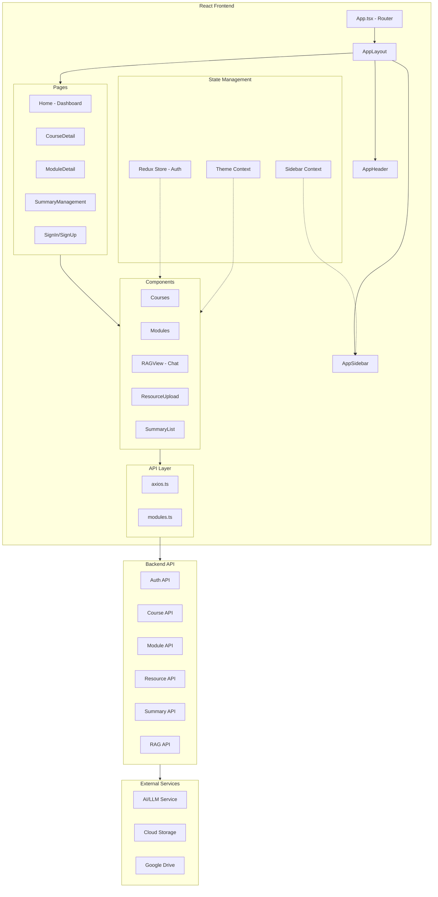

---

## 📱 User Flow Diagram

```mermaid
graph LR
    Start([User Visits App]) --> Auth{Authenticated?}
    Auth -->|No| SignIn[Sign In Page]
    Auth -->|Yes| Home[Home Dashboard]
    
    SignIn --> Login[Enter Credentials]
    Login --> AuthCheck{Valid?}
    AuthCheck -->|No| Error[Show Error]
    AuthCheck -->|Yes| Home
    
    Home --> SelectCourse[Select Course]
    SelectCourse --> CourseDetail[Course Detail]
    CourseDetail --> SelectModule[Select Module]
    SelectModule --> ModuleDetail[Module Detail]
    
    ModuleDetail --> View{Choose Action}
    View --> Chat[AI Chat - RAGView]
    View --> Resources[View Resources]
    View --> Upload[Upload Resource]
    View --> Summaries[View Summaries]
    
    Chat --> SelectRes[Select Resources]
    SelectRes --> TypeMsg[Type Message]
    TypeMsg --> Send[Send to AI]
    Send --> Response[Show Response]
    
    Upload --> SelectFile[Select File]
    SelectFile --> Process[Upload & Process]
    Process --> Complete[Upload Complete]
    
    Summaries --> GenSummary[Generate Summary]
    GenSummary --> Config[Configure Settings]
    Config --> Generate[AI Generates]
    Generate --> ViewSummary[View/Edit Summary]
```

---

## 🗂️ Component Tree

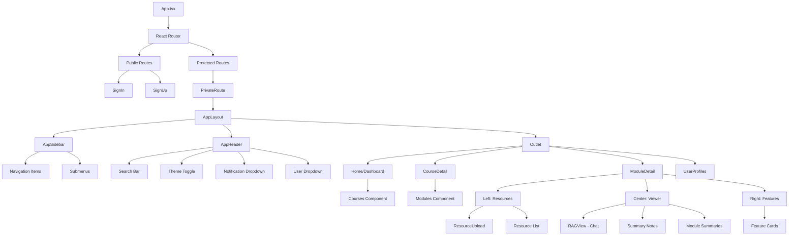

---

## 🔄 Data Flow

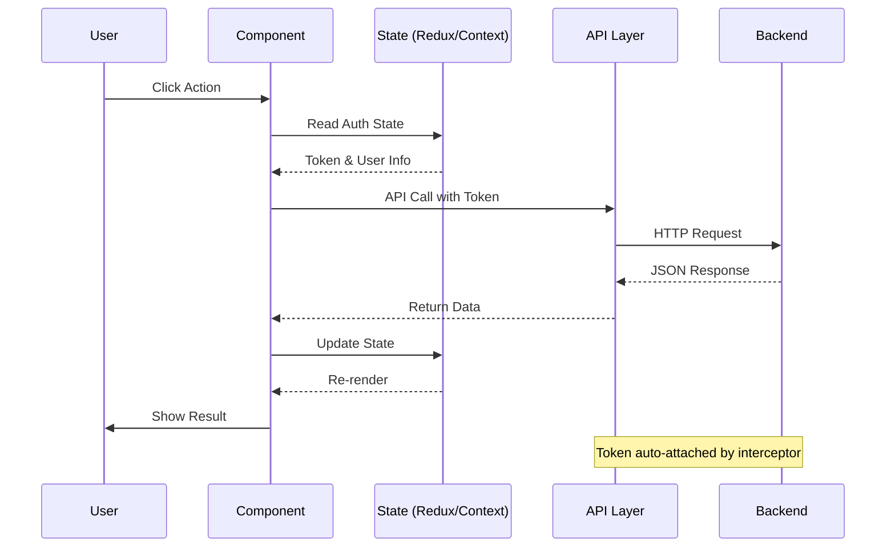

---

## 📊 State Management Flow

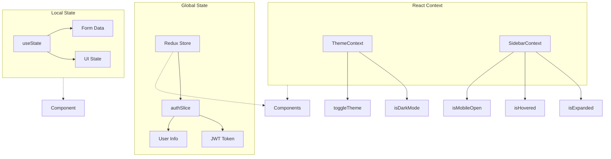

---

## 🛡️ Authentication Flow

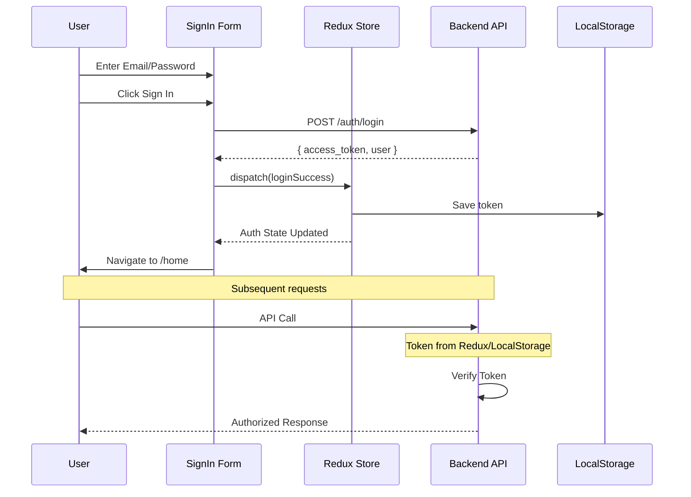

---

## 📁 File Upload Flow

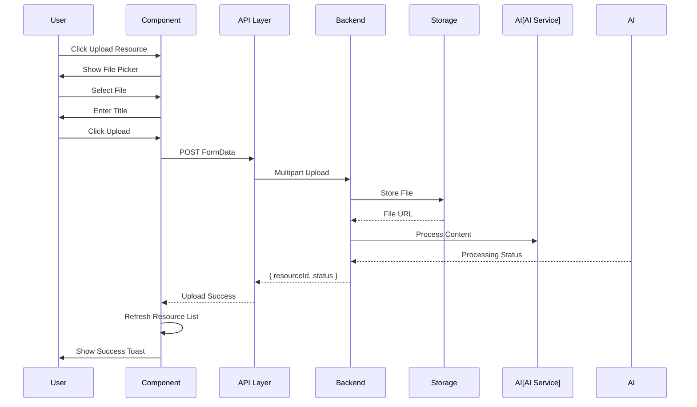

---

## 🤖 AI Summary Generation Flow

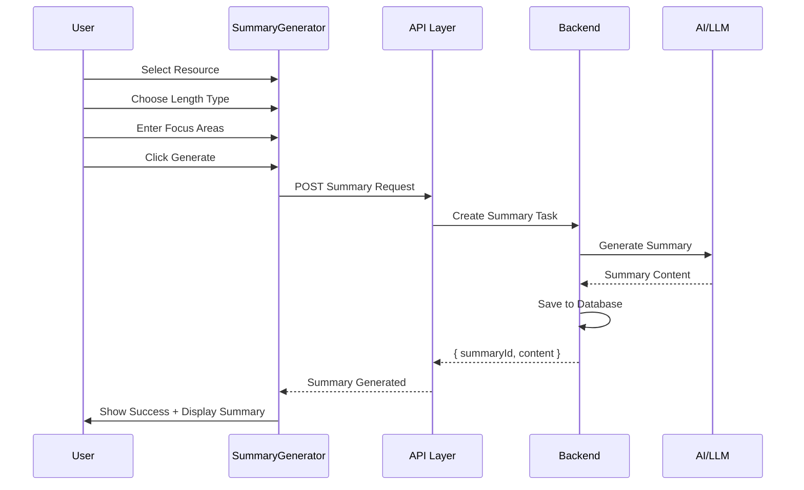

---

## 💬 RAG Chat Flow

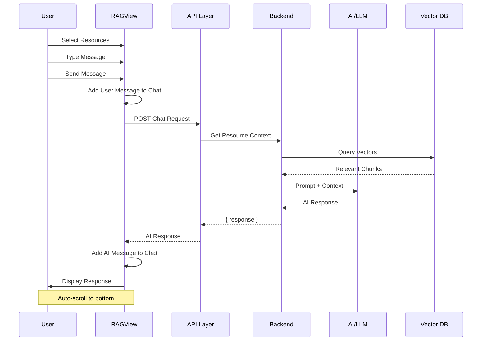

---

## 🎨 UI Component Hierarchy

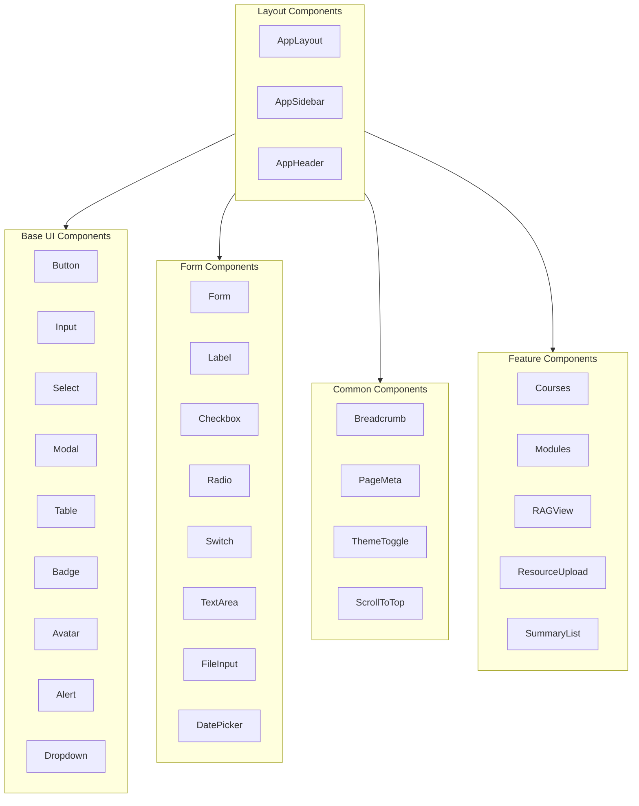

---

## 📱 Responsive Breakpoints

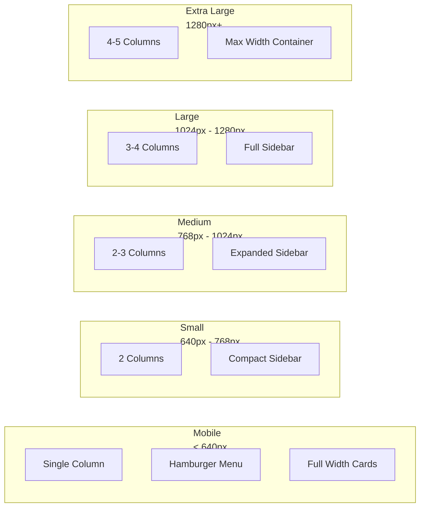

---

## 🔐 Route Protection

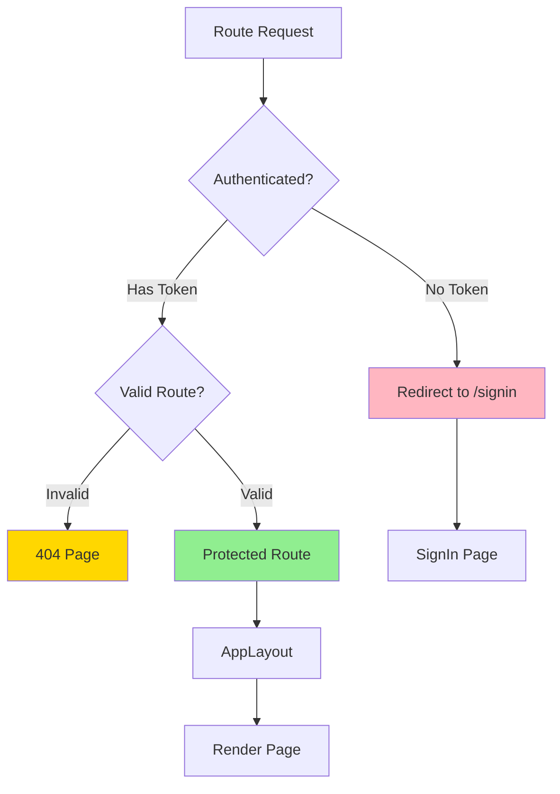

---

## 📦 API Endpoint Mapping

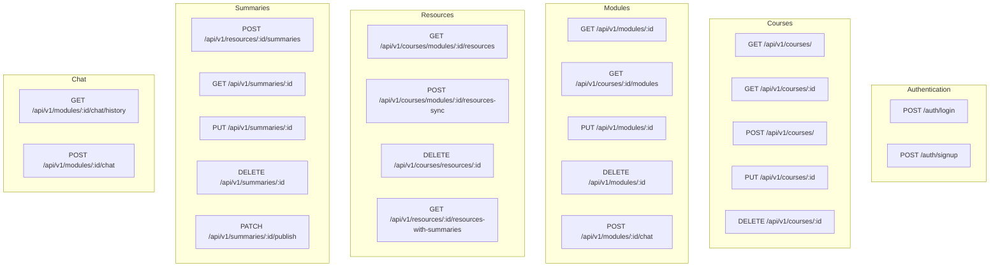

---

## 🎯 Key Features Map

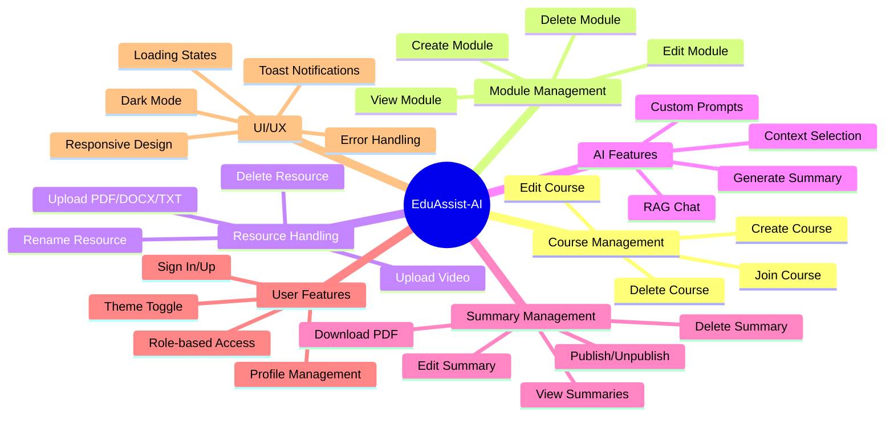

---

**Generated**: 2026-03-29  
**Version**: 2.0.2
